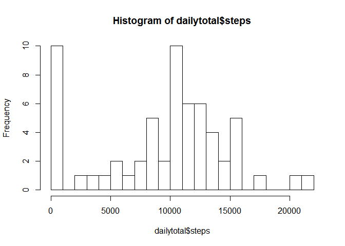
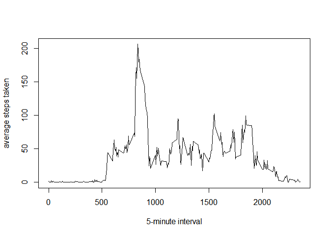
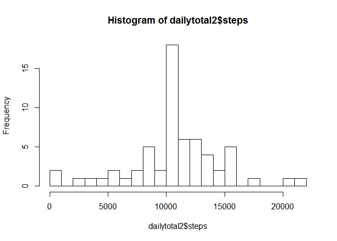
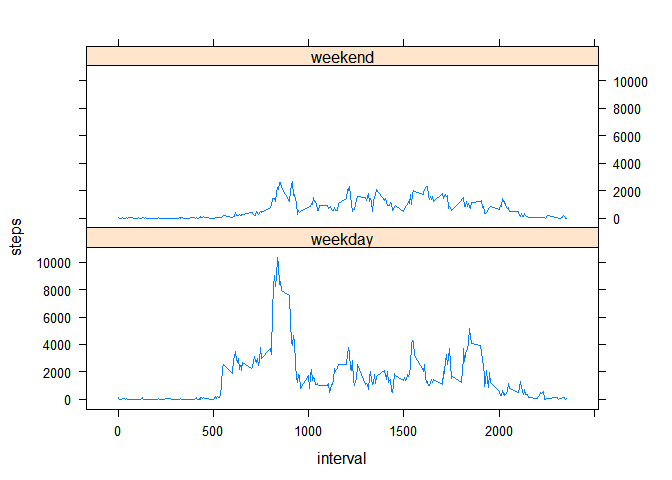

# Reproducible Research: Peer Assessment 1

This has been prepared by Brian Vitsmun for the first project of the
Reproducible Research class on Coursera. 

## Loading and preprocessing the data

Simple unzipping and reading the data.

I also store grouped data in a few variables, in prepation for later use.


```r
library(dplyr)
```

```
## 
## Attaching package: 'dplyr'
## 
## The following object is masked from 'package:stats':
## 
##     filter
## 
## The following objects are masked from 'package:base':
## 
##     intersect, setdiff, setequal, union
```

```r
library(lattice)

unzip("activity.zip")
data <- read.csv("activity.csv")

data$dayofweek <- weekdays(strptime(data$date, format="%Y-%m-%d"))

daily <- group_by(data, date)
interval <- group_by(data, interval)
```

## What is mean total number of steps taken per day?

The histogram seems to peak around 10,000, and the mean and median should fall somewhere around there.


```r
dailytotal <- summarize(daily, steps = sum(steps, na.rm=TRUE))
hist(dailytotal$steps, breaks=20)
```

 

Finding the exact values confirms this.


```r
mean(dailytotal$steps)
```

```
## [1] 9354.23
```


```r
median(dailytotal$steps)
```

```
## [1] 10395
```

## What is the average daily activity pattern?

The average daily activity pattern looks like the person normally wakes a
little after 5am, has their peak around 8am or 9am, activity is moderate
through the day, then starts tapering off around 8pm.

(Note that because of the way the intervals are numbered, there is a 
disproportionate line segment between the 55th interval and the 0th
each hour. I did not bother correcting for this, because it does not
significantly affect one's ability to gain a rough understanding of
daily activity patterns and approximate the period of peak activity.)


```r
meanint<-summarize(interval, average = mean(steps, na.rm=TRUE))
plot(meanint$interval,
     meanint$average,
     type="l",
     xlab = "5-minute interval",
     ylab = "average steps taken")
```

 


Finding the exact interval confirms that the peak activity is indeed between
8am and 9am. The highest average steps taken is during interval 835, which
corresponds to the 5 minute period starting at 8:35am.


```r
as.numeric(meanint[meanint$average == max(meanint$average),
                                  "interval"])
```

```
## [1] 835
```

## Imputing missing values

A few thousand of our step values are NA.


```r
nrow(data[is.na(data$steps),])
```

```
## [1] 2304
```

In fact, all of the NAs are within 8 specific days, and all 8 of those days
are NAs only ( 288 NAs recorded for the day)


```r
table(summarize(daily, NAS = sum(is.na(steps)))[, "NAS"])
```

```
## 
##   0 288 
##  53   8
```

We replace all NAs with the average steps for that interval, and store this altered set as data2.


```r
data2 <- data[!is.na(data$steps),]
databad <- data[is.na(data$steps),]

databad$steps <- summarize(group_by(data2, interval), steps = mean(steps))$steps

data2 <- rbind(data2, databad)
data2 <- ungroup(data2)
data2 <- arrange(data2, date, interval)
```

The histogram looks largely the same, though the tall bar at 0 has been reduced, and the peak bar near 10,000 is now taller. We would expect that changing all the data that was at 0 would cause the mean and median to increase a bit, the mean more than the median.


```r
daily2 <- group_by(data2, date)
dailytotal2 <- summarize(daily2, steps = sum(steps, na.rm=TRUE))
hist(dailytotal2$steps, breaks=20)
```

 

And indeed, the exact values confirm this.


```r
mean(dailytotal2$steps)
```

```
## [1] 10766.19
```


```r
median(dailytotal2$steps)
```

```
## [1] 10766.19
```

## Are there differences in activity patterns between weekdays and weekends?

First, a new column is created for the factor indicating weekday or weekend.


```r
data2$weekday <- ifelse(data2$dayofweek == "Sunday" | data$dayofweek == "Saturday", "weekend", "weekday")
data2$weekday <- as.factor(data2$weekday)
class(data2$weekday)
```

```
## [1] "factor"
```

```r
table(data2$weekday)
```

```
## 
## weekday weekend 
##   12960    4608
```


When we plot and compare the weekend average steps to the weekday average steps, we see that there is less activity generally, and the weekend doesn't have the notable morning and evening peaks, which likely related to travelling to and from work or school.


```r
weekdaydata2 <- summarize(group_by(data2, weekday, interval), steps = sum(steps, na.rm=TRUE))
xyplot(steps ~ interval | weekday, data = weekdaydata2, type = "l", layout = c(1, 2))
```

 
